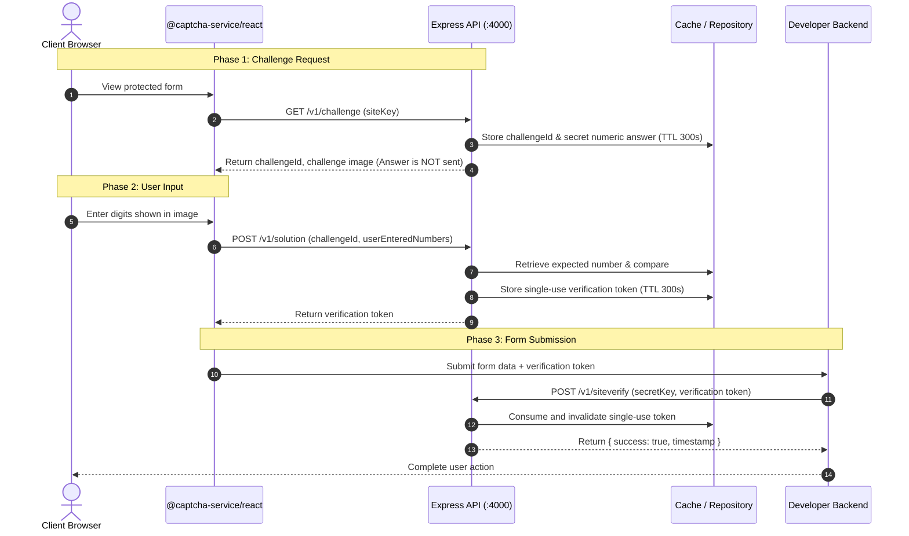

# CAPTCHA-as-a-Service Architecture

## 1. Overview
The CAPTCHA-as-a-Service platform is a modular, self-hostable service designed to protect web applications against automated bot submissions using numeric image challenges.

---

## 2. Backend MVC Architecture

The Express API backend (`apps/api`) follows a strict Model-View-Controller (MVC) separation of concerns:

```text
HTTP Request
     │
     ▼
[Middleware Layer]
  ├── Security headers (Helmet)
  ├── CORS origin checks
  ├── Body parsing (express.json)
  └── Rate limiting & input validation
     │
     ▼
[Routes Layer] (`src/routes/`)
  └── Maps URL endpoints and HTTP verbs to specific controller methods
     │
     ▼
[Controllers Layer] (`src/controllers/`)
  └── Handles HTTP requests and responses. Parses parameters, calls Services, returns JSON.
     │ (NO business logic in controllers)
     ▼
[Services Layer] (`src/services/`)
  └── Contains all business logic (challenge lifecycle, solution validation, score evaluation).
     │
     ▼
[Repositories Layer] (`src/repositories/`)
  └── Handles database and cache access (PostgreSQL via Prisma, Redis for ephemeral storage).
     │
     ▼
[Models Layer] (`src/models/`)
  └── Defines domain data structures, TypeScript types, and database schemas.
```

### MVC Layer Responsibilities

| Layer | Directory | Responsibility |
| :--- | :--- | :--- |
| **Models** | `src/models/` | Data structures, entity models, and TypeScript interfaces |
| **Controllers** | `src/controllers/` | Extracts HTTP parameters, delegates to services, sends HTTP responses |
| **Services** | `src/services/` | Contains core business logic; completely decoupled from Express `req`/`res` |
| **Repositories** | `src/repositories/` | Database and cache queries (PostgreSQL/Redis); abstracts persistence |
| **Routes** | `src/routes/` | Connects endpoints (e.g. `GET /health`) to corresponding controllers |
| **Middleware** | `src/middleware/` | Centralized error handling, 404 handler, input validation |
| **Config** | `src/config/` | Environment variables parsing and configuration defaults |
| **Utils** | `src/utils/` | Shared utilities (e.g. `ApiError`, logger) |

---

## 3. Numeric Image CAPTCHA Verification Flow



---

## 4. Key Security Rules

1. **Answer Isolation**:
   - The correct numeric answer is kept exclusively in server storage (Redis / DB).
   - Public client responses contain only the challenge ID, prompt, and image data. The answer is never transmitted in client responses.

2. **Key Segregation**:
   - `siteKey`: Public client identifier, restricted to allowed domain names.
   - `secretKey`: Private backend credential used exclusively for server-to-server verification (`/v1/siteverify`).

3. **Single-Use Verification Tokens**:
   - Verification tokens are strictly single-use and invalidated immediately upon redemption or TTL expiration.

4. **Constant-Time Verification**:
   - Cryptographic signatures and string comparisons utilize constant-time comparison (`crypto.timingSafeEqual`) to prevent timing attacks.

---

## 5. Monorepo Structure

```text
apps/
  api/          # Node.js + Express.js + TypeScript (MVC Architecture)
  dashboard/    # React + Vite developer administration portal
  playground/   # React + Vite interactive test harness

packages/
  core/         # Cryptographic and verification helpers
  react/        # Reusable <CaptchaWidget /> React component
  types/        # Shared Zod schemas and TypeScript interfaces

infra/
  docker-compose.yml  # Local PostgreSQL 16 and Redis 7 (no hardcoded secrets)

docs/
  ARCHITECTURE.md     # Architecture, MVC flow, and security rules
```
